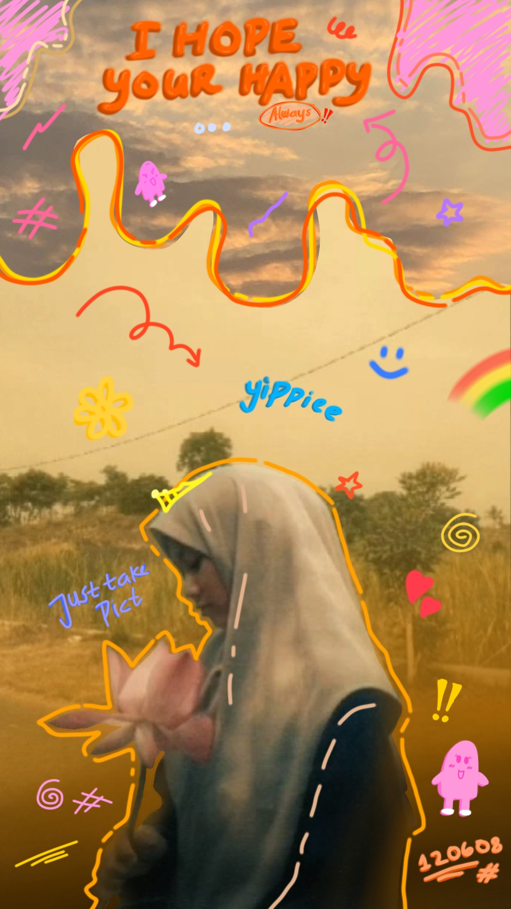

<!DOCTYPE html><html lang="id">
<head>
  <meta charset="UTF-8">
  <title>Serta Mulia</title>
  <link href="https://fonts.googleapis.com/css2?family=Poppins:wght@400;600&display=swap" rel="stylesheet">
  
</head>
<body>
  <!-- Audio Global (diputar setelah interaksi) -->
  <audio id="musikLatar" loop>
    <source src="Tulus - Monokrom _ Lirik Lagu Indonesia.mp3" type="audio/mpeg">
    Browser tidak mendukung audio.
  </audio>  <!-- Halaman 1 -->  

    

    

      <h1> Apa nihh??</h1>
      
Klik untuk melanjutkan

      <button onclick="pindahHalaman(2)">Lanjut</button>
    

  
  <!-- Halaman 2 -->  

    

    

      <h1>Pibesdeyy!!</h1>
      
Wish u all the bestt!
Semoga menjadi pribadi yang lebih baik,
semua keinginan bisa terwujud,
dan tetaplah menjadi orang baik. Ini hasil gabut aku wkwkk, maaf ya kalo jelek. SELAMAT MENONTON :)

      <video id="videoUlangTahun" controls>
        <source src="Tak berjudul55 (2).mp4" type="video/mp4">
        Browser tidak mendukung video.
      </video>
      

        <button onclick="pindahHalaman(3)">Mau download fotonya? Klik tombolnya aja</button>
      

    

  
  <!-- Halaman 3 -->  

    

      <h2>Download Foto</h2>
      
      <a href="Pibesdeyy.jpg" download>
        <button>Klik untuk download</button>
      </a>
    

  
  </body>
</html>
